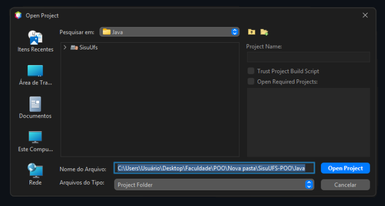
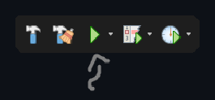
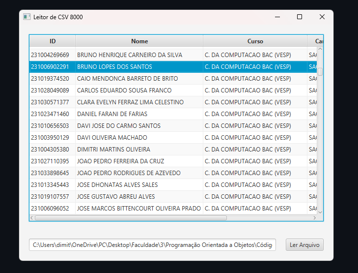
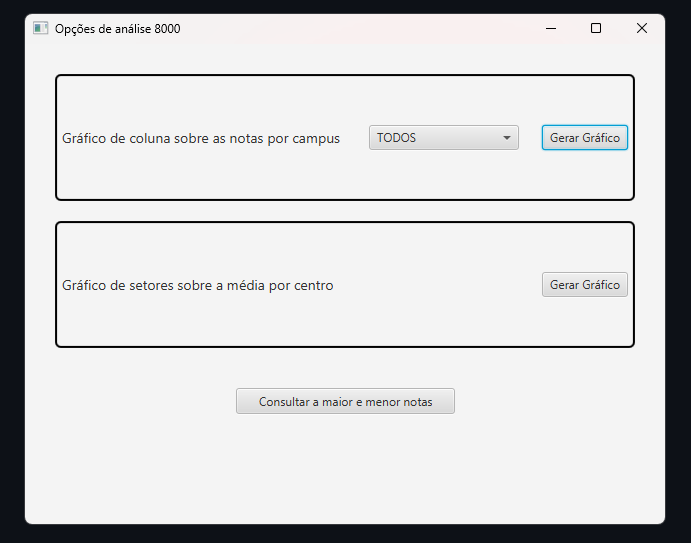
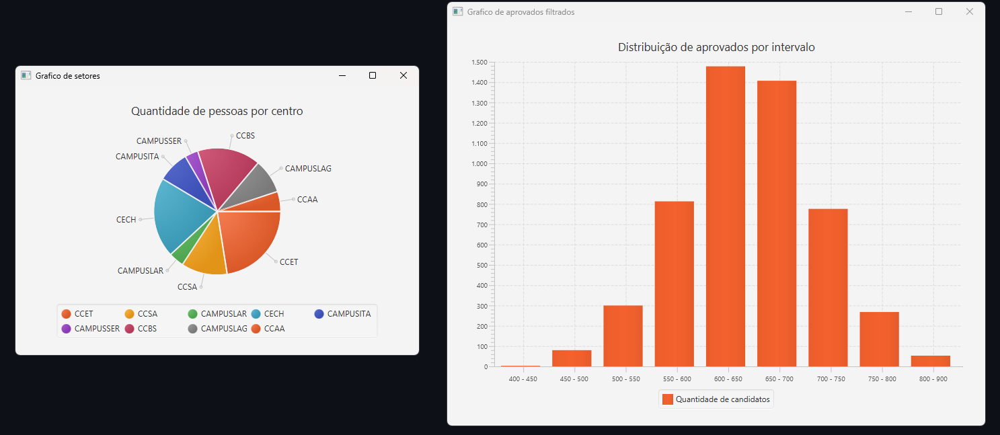

# Trabalho final da disciplina <br> Programação Orientada a Objetos:

&emsp; Esse projeto tem o intuito de abordar os conhecimentos ministrados na Universidade Federal de Sergipe acerca da Orientação a objetos(OO) na prática, onde nos foi proposto, pelo professor Leonardo Nogueira Matos, o desenvolvimento de uma aplicação em duas linguagens de programação distintas, Java e outra a critério da equipe. Essa dupla optou por desenvolvê-la em Python! 

## Integrantes da equipe:
- Dimitri Martins Oliveira (dimitt1)
- João Pedro Ferreira da Cruz (peusucodemanga)

##  Descrição do tema: Uma Análise exploratória dos dados do SISU da UFS
&emsp; A ideia principal do projeto é criar duas interfaces que sejam capazes de apresentar dados extraídos diretamente de arquivos CSV da folha de aprovados do SiSU/UFS de anos anteriores.

&emsp; Ademais, a criação de gráficos expositivos foi sugerida pelo docente como uma ferramenta de explorar a capacidade das linguagens de demonstrar como os dados podem ser interpretados e visualizados.

## Dependências e instruções de execução do projeto:

#### Java
&emsp; Para a execução dessa aplicação em Java, é necessário que o usuário tenha o Java Development Kit(JDK) devidamente instalado, como também a biblioteca JavaFX.


&emsp; A instalação do <a href="https://www.oracle.com/java/technologies/downloads/">JDK</a> deve ser feita pelo site da própria Oracle, já o processo para o JavaFX é variado, a recomendação é utilizar a IDE Netbeans que, ao iniciar um novo projeto utilizando-se o JavaFX, já executa a instalação da biblioteca.

##### Execução:
&emsp; Ao iniciar o NetBeans, clique em abrir o projeto no canto superior esquerdo e abra a pasta onde está localizada o repositório.

 </img> </img>

&emsp; Logo após abrir o projeto, o botão de reproduzir do aplicativo redireciona para o arquivo de execução de aplicativo, por fim, para executá-lo se faz necessário somente apertar esse botão.

&emsp; Uma forma alternativa de execução, uma vez com o JDK instalado, é, localizar o local do arquivo "SisuUfs-1.0-SNAPSHOT.jar", por meio do caminho: "SisuUFS-POO\Java\SisuUfs\target", abrir o terminal nessa pasta e executá-lo diretamente da linha de comando:

```bash 
java -jar SisuUfs-1.0-SNAPSHOT.jar
```

#### Python

&emsp; Já em Python, primeiramente é necessária a instalação do próprio <a href="https://www.python.org/downloads/">Python</a> e as bibliotecas utilizadas podem ser instaladas pela linha de comando:

```bash
    pip install pyqt5
    pip install pyqt5 pyqtchart
```
##### Execução: 
&emsp; Ao baixar as dependências necessárias, o arquivo principal que deve ser executado é o de nome "_leitorCSV_". Ao acessá-lo, a execução é feita pela própria IDE preferida ou pelo terminal aberto na pasta "_Python_" e colocando o comando: 
```bash
    python leitorCSV.py
```
## Discussão do projeto desenvolvido:
&emsp; O primeiro passo para a análise dos dados é tratá-los. Após a separação dos PDFs e a conversão para ler o arquivo CSV escolhido, urgiu a necessidade da criação de uma interface gráfica simples, tanto para tratar as questões de I/O com o usuário, quanto para exibição dos gráficos formatados. 

&emsp; Para a linguagem Java, foi utilizada a biblioteca JavaFX, aliado ao SceneBuilder. Já para a linguagem Pyton, a biblioteca escolhida foi a PyQt5, juntamente ao Qt Designer. Ambas as bibliotecas sugeridas e abordadas em aula pelo docente. Quanto às IDEs, foram utilizados o Apache NetBeans e o VisualStudio Code.

### Janelas criadas

&emsp; A aplicação desenvolvida conta com três janelas principais. Tendo como o mesmo raciocínio em Java e em Python. Durante a apresentação dessas janelas, serão utilizados prints da aplicação em Java, mas o resultado em Python é bem similar.


&emsp; Inicialmente, a interface tem uma tela de entrada, composta por um campo de digitação, uma área de exibição dos dados lidos e um botão que ativa o leitor de CSV, leitor esse que facilita a leitura de arquivos e a confirmação dos mesmos. A ação disparada pelo botão lê o arquivo, armazena os dados dos candidatos, exibe-os na tela e instancia a segunda janela. 

</img>

<!--[Exibição da Janela Principal](./imagensMD/janela1.png "Janela Principal")-->

&emsp; Em seguida, surge a segunda janela, que disponibiliza três opções ao usuário:
- Um botão para gerar um histograma, filtrado por uma caixa de seleção, acerca dos intervalos de notas dos candidatos.
- Um botão para gerar um gráfico de setores da quantidade de pessoas por centro;
- Um botão para consultar a maior e menor notas, que aparecem diretamente abaixo do botão;

&emsp; Ambos os botões que criam gráficos são responsáveis por exibir a terceira janela.

</img>
<!--  -->

&emsp; A terceira janela é a responsável por exibir os gráficos, no caso da aplicação em Java, pode existir uma quarta janela, quando ambos os gráficos são exibidos, mas em Python, apenas uma é ativa por vez.



##### Dificuldades encontradas
&emsp; Alguns pontos importantes e que se mostraram desafiadores durante o desenvolvimento do projeto foram os controladores das cenas, inicialmente gerados pelos respectivos builders de cada GUI, mas que posteriormente são especializados para atenderem a necessidades específicas. 

&emsp; Outra dificuldade recorrente foi o encaminhamento de dados entre arquivos/janelas diferentes, uma solução em Java foi a utilização de um padrão de projeto Singleton, mas em Python a solução encontrada foi lidar com o armazenamento de variáveis em um arquivo e operar a UI e todo o arranjo visual em classes separadas, utilizando imports para o arquivo principal.   

## Discussão da Orientação a Objetos em Python:
&emsp; A segunda linguagem escolhida, Python, não é uma linguagem estritamente Orientada a Objetos, porém, podemos utilizar de artificios da mesma para exprimir e se manter as características desse paradigma discutido por todo esse projeto. Essa discussão será dividida entre os principais tópicos de OO observados durante a escrita do código, utilizando trechos desse para exemplificar tais conceitos.

&emsp; Inicialmente a classe MainWindow é instanciada para apresentar a primeira janela supracitada e logo nela podemos ver características intrínsecas ao assunto abordado. 

```py

class MainWindow(QtWidgets.QMainWindow, Ui_MainWindow):

    def __init__(self, *args, obj=None, **kwargs):
        super(MainWindow, self).__init__(*args, **kwargs)
        self.setupUi(self)
        self.setWindowTitle("Leitor de CSV 8000")
```
#### Herança

&emsp; Na primeira operação do código é imperativo denotar a herança sendo utilizada na classe "_MainWindow_", tendo como pai a classe "_QtWidgets.QMainWindow_", dessa maneira herdando as suas propriedades.

&emsp; Em segundo lugar, temos o método "_\_\_init\_\__" que funciona como um construtor para essas classes, nesse caso, ela trabalha com a construção da janela. E ao mesmo tempo, atuando como uma sobrescrição, pois, a classe pai também possui o método "_\_\_init\_\__". 

&emsp; Um detalhe fundamental nesse trecho de código é a presença de herança múltipla de classes concretas, mecanismo permitido apenas com o uso de interfaces em Java. Python trata essa questão com o conceito de ordem de resolução múltipla (MRO), responsável por definir uma hierarquia entre as superclasses.  

#### Encapsulamento

&emsp; Ainda analisando o método "_\_\_init\_\__", também há a presença do encapsulamento - um dos pilares da OO -, por meio dos pseudo-modificadores de visibilidade "\_", que, nesse caso, simbolizam um método privado. Contudo, esses modificadores não garantem que um método ou atributo realmente não poderá ser acessado onde não deveria.

#### Polimorfismo

&emsp; Uma adição curiosa ao tema é que o polimorfismo paramétrico não existe em Python. Ao analisar esse polimorfismo é possível perceber sua relação direta com a tipagem de uma variável, pois em Java, esse polimorfismo é viabilizado pela utilização de um politipo, geralmente denotado por \<T>.

&emsp; Ao lidar com uma linguagem de tipagem dinâmica, esse polimorfismo perde a utilidade, uma vez que os parâmetros não precisam ter os seus tipos declarados, eles também não utilizam e necessitam dessa funcionalidade.

&emsp; Entretanto, existem outros tipos de polimorfismo em Python, como o polimorfismo de sobrescrita, já evidenciado anteriormente no método "_\_\_init\_\__".

#### Tratamento de exceções
```py
    try:
        with open(arquivo, 'r', newline='') as file:
            leitorCSV = csv.reader(file)
            if (".csv" not in arquivo):
                    raise IOError("O arquivo não respeita o formato")
            Cabecalho = next(leitorCSV)
            ...
    except FileNotFoundError:
            msg = QtWidgets.QMessageBox()
            msg.setIcon(QtWidgets.QMessageBox.Critical)
            msg.setText("Erro, não consegui achar o arquivo " + arquivo + " :(\n")
            ...
    except IOError:
            msg = QtWidgets.QMessageBox()
            msg.setIcon(QtWidgets.QMessageBox.Critical)
            msg.setText("Erro! O arquivo " + arquivo + "\nnão respeita o formato exigido!\n")
            ...

```

&emsp; Aqui nesse trecho de código temos um exemplo de tratamento de exceções que, embora não seja um recurso exclusivo de linguagens OO, exemplifica conceitos primordiais desse paradigma.

&emsp; As exceções em Python, assim como em Java, são objetos que seguem uma hierarquia preestabelecida de classes, possibilitando a utilização de múltiplos blocos "_except_" para tratar exceções de classes distintas e especializar o tratamento dependendo da origem do erro.

&emsp; Vale notar que o processo de lançamento de uma exceção utilizando o operador "_raise_", também se assemelha muito com Java, por meio do comando "_throw_". No caso do código, está sendo lançada uma exceção explicitamente, caso o arquivo carregado pelo usuário exista, mas não respeite o formato .csv necessário.

&emsp; Uma diferença notável nas exceções do Python é que, diferentemente de Java, não há a diferenciação entre exceções verificadas e não verificadas, o interpretador do Python trata todas como não verificadas, dessa forma não sendo obrigatório o anúncio ou tratamento dessas. 

## Conclusões

&emsp; Ao decorrer do desenvolvimento do projeto foi possível entender na prática como funciona um ciclo de trabalho utilizando a orientação a objetos e como ela viabiliza a divisão de múltiplas tarefas através de soluções pouco acopladas entre si, mas extremamente coesas, ao serem unidas.

&emsp; Ademais, o desafio de desenvolver a solução utilizando uma segunda linguagem não estritamente orientada a objetos, serviu como uma maneira muito eficaz para consolidar os conhecimentos adquiridos durante toda a disciplina de Programação Orientada a Objetos. Visto que foi necessário explorar apenas as funcionalidades implementadas pela linguagem que seguem o paradigma, de modo a adaptar a solução feita, sem perder as propriedades da OO.


&emsp; Durante a construção desse repositório, foi utilizado um <a href= "https://github.com/iuricode/padroes-de-commits">padrão de commits</a> para categorizar as atualizações feitas.
## Link para o repositório 
<a> https://github.com/peusucodemanga/SisuUFS-POO </a> 